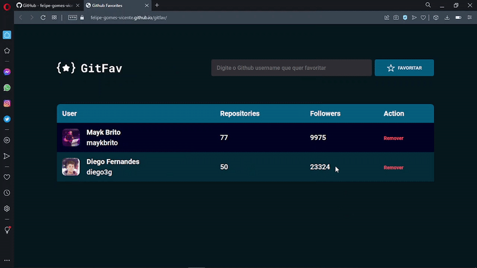
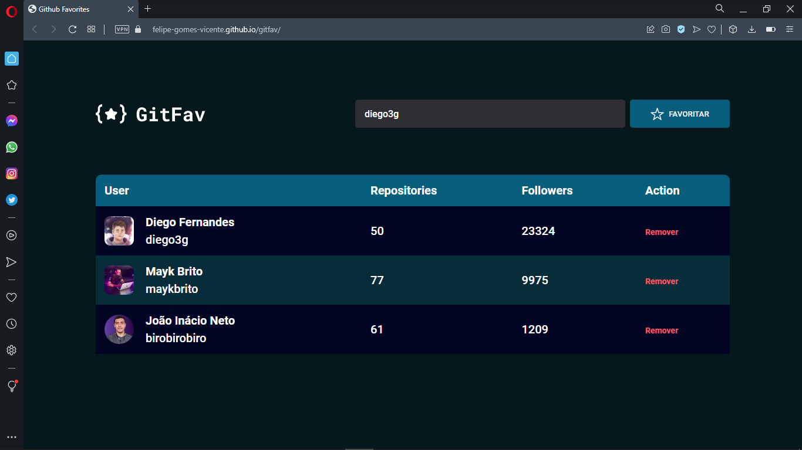

# Github Favorites

<h1 align="center">
    
</h1>

<br>

### 💻 Github Favorites

O desafio é construír uma página GitFav para consumir APi do Github e manipular dados ao salvar, exibir em uma tabela e excluir com HTML, Javascript e CSS, foi aplicado Programação orientado a objetos, eventos, classes, herança e polimorfismo.

Acesse a página do projeto: [Clique Aqui](https://felipe-gomes-vicente.github.io/gitfav/)

O que foi feito:

- Lógica e Algoritmos com Javascript;
- Consumo de API pública do Github;
- LocalStorage para salvar os dados;
- Imutabilidade dos dados;
- Promessas com Async Await;
- Classes e eventos;
- Herança e Polimorfismo;
- Tratar erros com try, catch e throw
- Mapeamento de rotas;
- Assíncrono e promises;
- Orientação a objetos;
- Layout do Figma;
- Tipos de dados no javascipt;
- Manipular a DOM;
- Funções callbacks;
- Clean Code;
- ES6 Modules;
- Injeção de dependências;
- Estruturando HTML com tags semânticas;
- Unidade de medida flexível;
- Importar arquivo de CSS externo no projeto;
- Aplicando fontes(tipografia) customizadas no arquivo do CSS e iniciar o CSS externo;
- Trabalhando com cores e fontes;
- Acessibilidade sr-only;
- Alinhando e posicionando textos e elementos;
- Aplicando os espaçamentos;
- Bordas e classificações de elementos;
- Transições em CSS;
- Utilizar variaveis CSS para manipular a paleta de cores do projeto e tamanho da fonte;
- Reset CSS removendo possíveis inconsistências entre navegadores diferentes;
- Estrutura de sistema de arquivos do projeto separado por pasta;


Aplicado meu conhecimento do Explorer da Rocketseat conceitos de forma prática nesse projeto, com as aulas:

- Conhecendo novos conceitos de HTML e CSS;
- Avançando no HTML e CSS;
- Introdução á Programação, Lógica e Algoritmos com Javascript;
- Avançando na Programação WEB com Javacript;
- Javascript antes do Framework;
- Avançando nas Promises;
  
<br />

- [EXPLORER - Rocketseat](https://www.rocketseat.com.br/explorer)
- [Figma do Desafio - GitFav](https://www.figma.com/file/B5PCSL3rEAoYJro6QFKYtp/%5BDesafios-Explorer%5D-GitFav-(Copy)-(Copy))

## Imagem do Projeto concluído:
 

 <br />

## 🧪 Tecnologias

Aplicação desenvolvida usando as seguintes tecnologias:

- [HTML5](https://www.w3schools.com/html/default.asp)
- [CSS3](https://www.w3schools.com/css/default.asp)
- [Javascript](https://developer.mozilla.org/pt-BR/docs/Web/JavaScript)

## 🚀 Iniciar Projeto

Clonar Projeto e acesar pasta e iniciar Live server no Visual Studio Code.

### Programas necessários para iniciar projeto

- [Live Server (Opcional)](https://marketplace.visualstudio.com/items?itemName=ritwickdey.LiveServer)
- [Visual Studio Code - Vscode](https://code.visualstudio.com/)

Clone o projeto e acesso a pasta.

```bash
$ git clone https://github.com/felipe-gomes-vicente/gitfav.git
$ cd gitfav
```

## 📝 Licença

Esse projeto está sob a licença MIT. Veja o arquivo [LICENSE](LICENSE.md) para mais detalhes.

---

&nbsp;

<p align="center">Feito com 💜 by Felipe Vicente👋</p>

- ## Meu LinkedIn - [](https://www.linkedin.com/in/felipe-gomes-vicente/)
